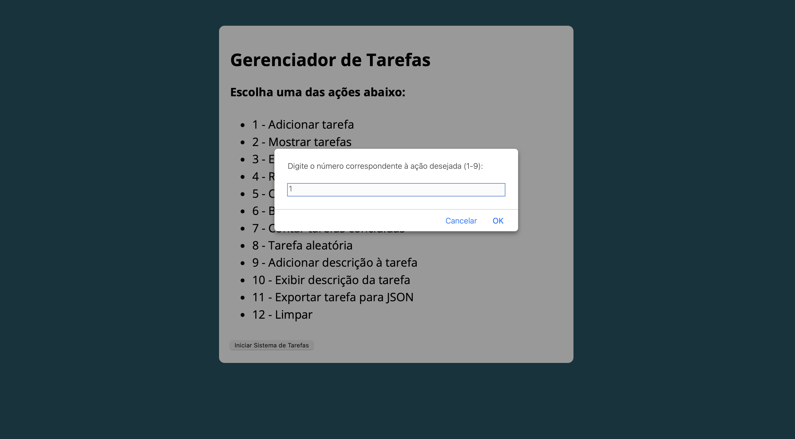
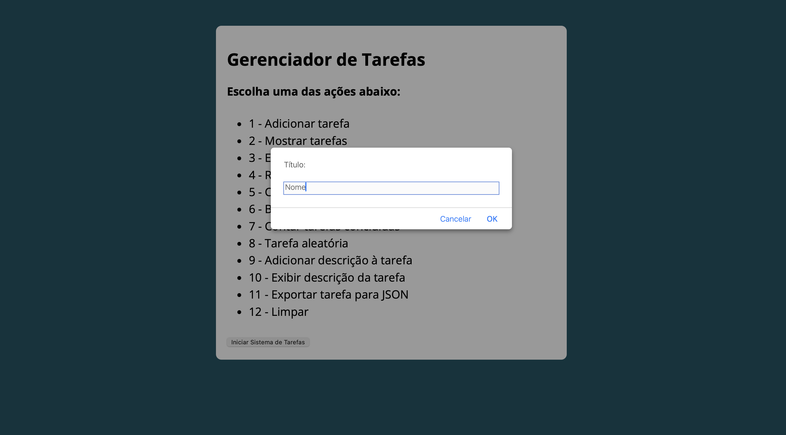
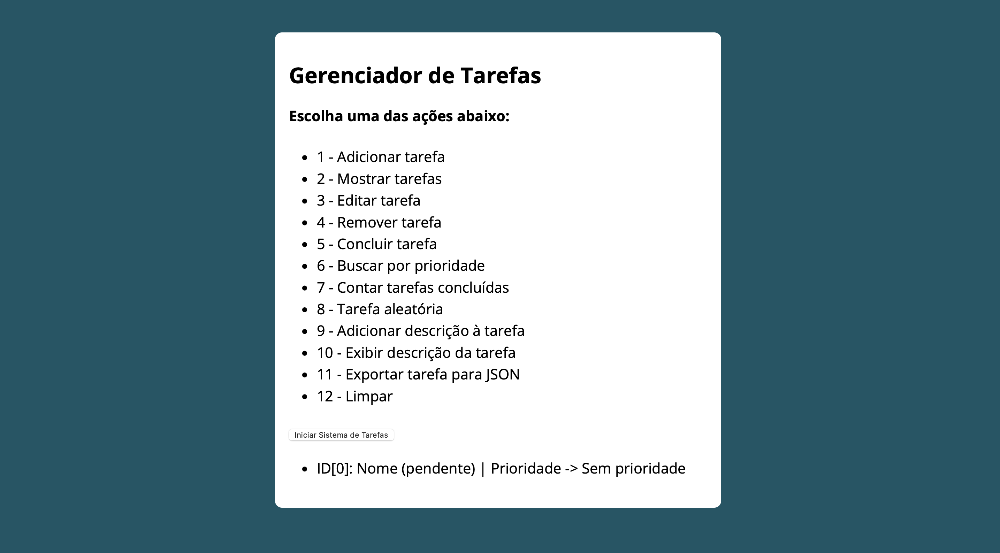
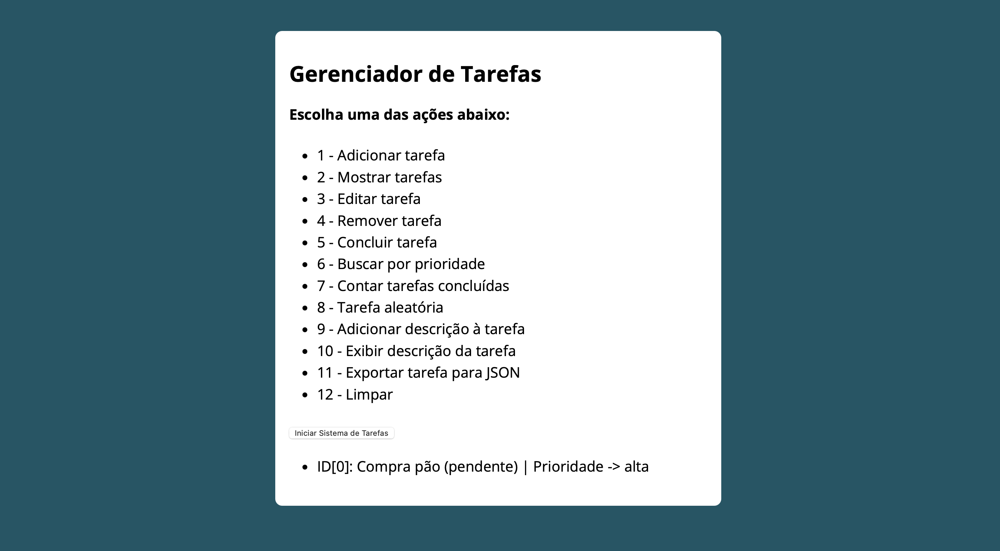
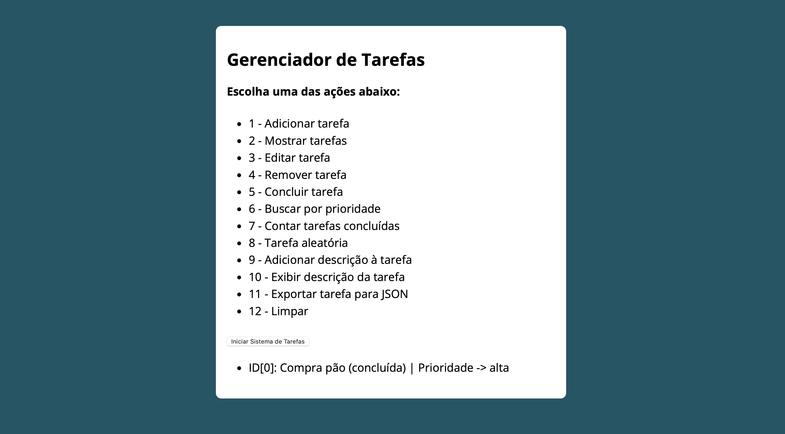
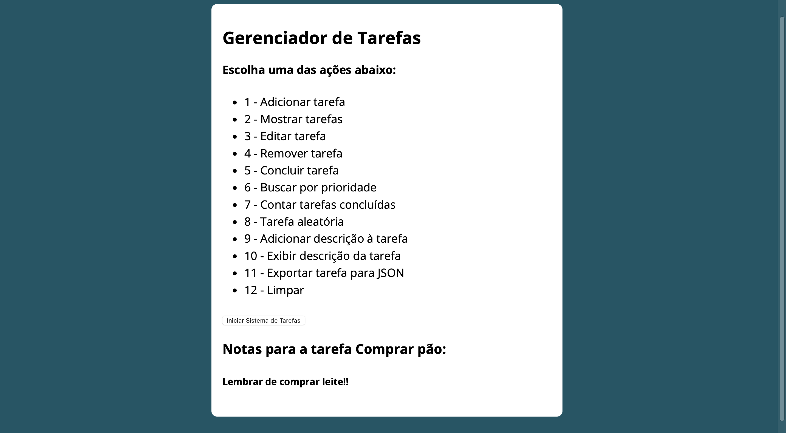
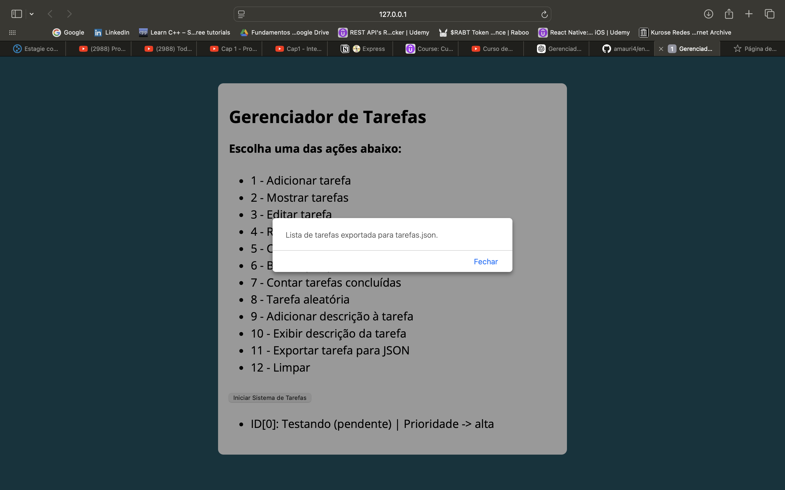
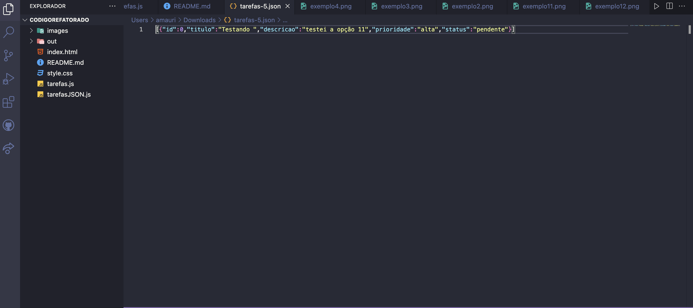
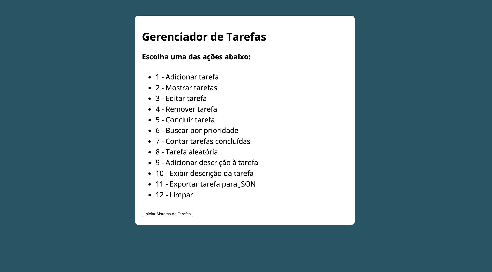

# Gerenciador de Tarefas

Um sistema simples de gerenciamento de tarefas desenvolvido em JavaScript, permitindo adicionar, editar, remover e visualizar tarefas com suporte a prioridades e status.

## Guia de Instalação e Configuração

### Pré-requisitos

Antes de instalar e executar o sistema, verifique se você possui os seguintes pré-requisitos:

- **Navegador Web**: O sistema requer um navegador web moderno (como Google Chrome, Mozilla Firefox ou Microsoft Edge).

### Instalação

1. **Clone o repositório**:

   ```bash
   git clone https://github.com/SEU_USUARIO/gerenciador-tarefas.git
   cd gerenciador-tarefas

2. **Teste o programa usando um servidor local**:

## Usando o Visual Studio Code (VSCode)

Para abrir um Live Server no VSCode, siga os passos abaixo:

1. **Instale a Extensão Live Server:**
   - Abra o Visual Studio Code.
   - Vá até a aba de extensões clicando no ícone de quadrados (ou pressione `Ctrl + Shift + X`).
   - Na barra de pesquisa, digite "Live Server" e pressione `Enter`.
   - Encontre a extensão "Live Server" de **Ritwick Dey** e clique em "Instalar".

2. **Abra seu Projeto:**
   - Abra a pasta onde está seu arquivo `index.html` no VSCode.

3. **Inicie o Live Server:**
   - Clique com o botão direito do mouse no arquivo `index.html` na árvore de arquivos.
   - Selecione a opção "Open with Live Server".
   - O Live Server abrirá seu arquivo HTML em uma nova aba do navegador.

4. **Atualizações em Tempo Real:**
   - Qualquer alteração feita no seu arquivo HTML será automaticamente recarregada no navegador.

## Usando um Método Alternativo (Sem Extensões)

Se você não quiser usar o VSCode ou a extensão Live Server, pode abrir seu arquivo HTML diretamente no navegador de uma das seguintes maneiras:

### Método 1: Abrir Diretamente no Navegador

1. **Localize o Arquivo HTML:**
   - Navegue até a pasta onde está seu arquivo `index.html` usando o explorador de arquivos do seu sistema operacional.

2. **Abra o Arquivo no Navegador:**
   - Clique com o botão direito do mouse no arquivo `index.html`.
   - Selecione "Abrir com" e escolha o navegador de sua preferência (Chrome, Firefox, etc.).

### Método 2: Usar um Servidor Local (Python)

Se você tem Python instalado, pode usar um simples servidor HTTP. Siga os passos abaixo:

1. **Abra o Terminal ou Prompt de Comando:**
   - Navegue até a pasta onde está o seu arquivo HTML.

2. **Inicie o Servidor:**
   - Se estiver usando Python 3, execute:
     ```
     python -m http.server
     ```
   - Se estiver usando Python 2, execute:
     ```
     python -m SimpleHTTPServer
     ```

3. **Acesse no Navegador:**
   - Abra o navegador e digite `http://localhost:8000` na barra de endereços.
   - Você verá uma lista de arquivos; clique no `index.html` para visualizá-lo.

# Descrições das Tarefas do Sistema de Gerenciamento de Tarefas (guia de uso)

## 1. Adicionar Tarefa
Insira o título, descrição e prioridade da tarefa.
Exemplo:
- Título da Tarefa: Comprar pão
- Descrição: Ir à padaria e comprar 2 pães.
- Prioridade: alta

**Selecionando a função:**


**Colocando o título(para as demais informações, deve-se seguir o mesmo procedimento):**


**Resultado:**


---

## 2. Mostrar Tarefas
Exibe todas as tarefas cadastradas, incluindo título, descrição, prioridade e status.
Exemplo:
- Tarefas:
  - 0: Comprar pão - alta - pendente



---

## 3. Editar Tarefa
Permite editar o título, descrição ou prioridade de uma tarefa existente.
Exemplo:
- ID da tarefa: 0
- Novo título: Pão e leite

---

## 4. Remover Tarefa
Remove uma tarefa especificada pelo seu ID.
Exemplo:
- ID da tarefa a ser removida: 0

---

## 5. Marcar Tarefa como Concluída
Marca uma tarefa como concluída.
Exemplo:
- ID da tarefa a ser concluída: 



---

## 6. Buscar por Prioridade
Permite buscar e exibir tarefas de uma determinada prioridade.
Exemplo:
- Digite a prioridade (alta, média, baixa): alta

---

## 7. Contar Tarefas Concluídas
Exibe a contagem total de tarefas que foram concluídas.
Exemplo:
- Total de tarefas concluídas: 5

---

## 8. Selecionar Tarefa Aleatória
Seleciona e exibe uma tarefa aleatória da lista.
Exemplo:
- Tarefa aleatória: Comprar pão - alta - concluída

---

## 9. Adicionar Descrição a uma Tarefa
Adiciona uma descrição ou nota a uma tarefa existente.
Exemplo:
- ID da tarefa: 0
- Descrição adicional: Comprar também leite.

---

## 10. Exibir Descrição de uma Tarefa
Exibe a descrição ou notas de uma tarefa especificada pelo ID.
Exemplo:
- Notas para a tarefa (Nome da tarefa):
- Descrição: Também comprar leite!!



---

## 11. Exportar Tarefas para JSON
Exporta todas as tarefas cadastradas para um arquivo JSON.
Exemplo:
- Tarefas exportadas para tarefas.json.

**Baixar as tarefas em formato JSON:**


**Arquivo JSON:**


**OBS: deve-se dar permissão para que o arquivo JSON seja baixado.**

---

## 12. Limpar Console
Limpa o que estiver na tela para uma visualização mais nítida.



